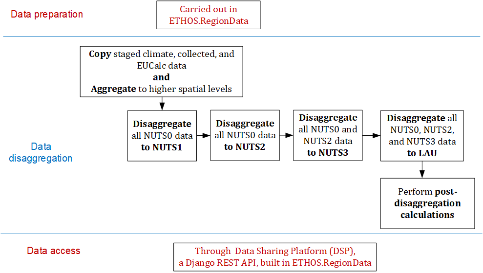
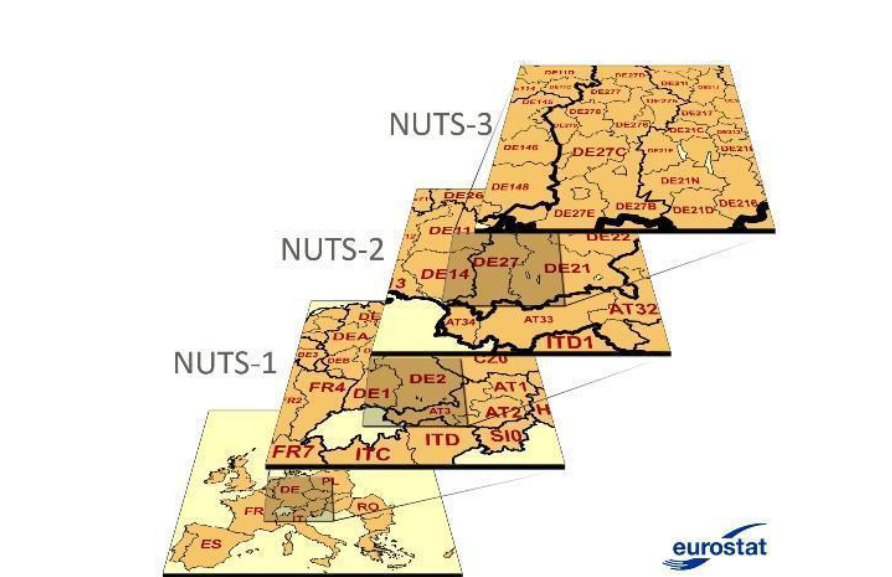

<!-- markdownlint-disable line-length no-inline-html -->
# ETHOS.zoomin: A spatial disaggregation workflow tool developed within the LOCALISED project.

ETHOS.zoomin is a workflow tool which mainly spatially disaggregates staged [ETHOS.RegionData](https://jugit.fz-juelich.de/iek-3/shared-code/localised/ETHOS.RegionData) data and dumps it 
into the database, created by ETHOS.RegionData. The stages involved are shown in the figure below: 



Before jumping into the details of the stages, it is important to understand spatial hierarchies in the EU. As shown in the figure below, NUTS0 regions or countries are spatially divided into 
NUTS1 regions, which in-turn are divided into NUTS2, and finally to NUTS3. The finest spatial resolution is LAU, which further divides the NUTS3 regions. 



Now, the stages involved in the ETHOS.zoomin workflow are explained below:

### Copy and aggregate staged data
- The data present in `staged_climate_data`, `staged_collected_data`, and `staged_eucalc_data` tables, in the database, is copied into `processed_data` table.
- This data is then aggregated to higher spatial levels. For example, climate data is collected at NUTS3 level. This is aggregated to NUTS2, NUTS1, and NUTS0. The reason for aggregation is to allow the users of the DSP 
    to query data at any spatial level. 

### Data disaggregation 
Once the copy and aggregation is done, the data is disaggregated to finer spatial levels. As you know different datasets are collected at different spatial levels. For example, the climate data is collected at NUTS3 level, 
whereas EUCalc data is collected at NUTS0 level. 

The disaggregation is carried out in stages. At each stage, a finer spatial level is chosen, and all the data collected at coarser spatial levels are disaggregated to this level: 
1. **Disaggregation to NUTS1:** At the first stage, NUTS1 is chosen and all the data collected at NUTS0 is disaggregated to NUTS1 level.  
2. **Disaggregation to NUTS2:** Next, NUTS2 is chosen and all the data collected at NUTS0 is disaggregated to NUTS2 level. NOTE: Technically, NUTS1 data also needs to be disaggregated to NUTS2 at this stage, but no data is collected at NUTS1 level 
    and therefore, not included here. 
3. **Disaggregation to NUTS3:** Next, NUTS3 is chosen and all the data collected at coarser spatial levels, i.e., NUTS0 and NUTS2, are disaggregated to NUTS3. 
4. **Disaggregation to LAU:** Similarly, all the data at higher spatial levels is disaggregated to LAU. 

Advantage of this stage-wise disaggregation - any of these stages can be turned off and it does not affect other stages. This speeds up deploy if, for example, only NUTS3-level is desired in a particular deploy. 

In each of these stages, the following steps are carried out:
1. Pull data from staged data tables in the database.
2. Disaggregate data based on proxy specifications present in the database.
3. Evaulate quality rating - miniumum of the quality of the data to be disaggregated, proxy data and the confidence in the assigned proxy.  
4. Dump the disaggregated data into `processed_data` table in the database.

### Post-disaggregation calculation 
Some datasets are not present in the staged data tables, but need to be calculated from the datasets present. For example: variable "eucalc_agr_ch4_liv_enteric_abp_dairy_milk_ei" calculates the emission intensity and is defined as "eucalc_agr_emissions_ch4_liv_enteric_abp_dairy_milk / eucalc_agr_domestic_production_liv_abp_dairy_milk". In this case, once the variables "eucalc_agr_emissions_ch4_liv_enteric_abp_dairy_milk" and "eucalc_agr_domestic_production_liv_abp_dairy_milk" 
are disaggregated, the emission intensity needs to be calculated, at all the spatial levels. This is carried out here. 

The SQL commands, to carry out the calculation, are prepared and stored in the database. These commands are simply executed at this stage. 


## Installation

0. Before you install this repo, please make sure you have run the ETHOS.RegionData workflow so that the database is created. 

1. Clone this repository:
    ```bash
    git clone https://jugit.fz-juelich.de/iek-3/shared-code/localised/ETHOS.zoomin.git
    ```

2. Install dependencies and the repo in a clean conda environment.:
    ```bash
    cd ETHOS.zoomin
    mamba env create --file=requirements.yml
    mamba activate zoomin
    pip install -e .
    ```

## Environment variables

Information such as database credentials, database name, version, etc. are passed to the python scripts as environment variables. For example, DB_PASSWORD is imported in `zoomin/db_access.py`. Therefore, we need to create an environment file where this information is stored. However, this file is never pushed to GitHub because its added to `.gitingore`. This is desired because information such as database credentials is sensitive and should not be made public. 

You need to create your own `.env` file on your local machine, within the ETHOS.zoomin repository. After you create an empty `.env` file, you can simply copy-paste the below contents into this file and modify the DB_PASSWORD and any other variable.  

```bash
ENV_NAME=zoomin #name of the environment. The default env_name in this case is "zoomin". Checkout "requirements.yml" for more info.

DB_COUNTRY=IT # The country you wish to work with 
DB_VERSION=6 # The database version you wish to work with 

DB_ENGINE=django.db.backends.postgresql # indicate for Django that postgres databases are used in thr project
DB_USER=postgres # database username, default is always "postgres"
DB_PASSWORD=So%e_pwd # database password, the one you entered when installing postgres 
DB_HOST=127.0.0.1 # in develop mode, only localhost (127.0.0.1) would be allowed hosts
DB_PORT=5432 # this is the default port of postgres 

MINI_DB=1 # Disaggregating the whole data takes a lot of time. 
        # Therefore, during development, it is limited to a small sub-set of data, by setting MINI_DB to 1. 
        # If MINI_DB is 1, fewer variables are disaggregated (See `zoomin/snakemake_utils.py` for more info) 
        # And only EUCalc national pathway and years 2020 and 2030 are considere (See snakefiles for more info)
```

## Snakemake workflow 
Each stage described above is run using snakemake. See `snakemake` folder for more details. To run all the snakemake workflows i.e., all the stages, run `run_mini_deployment.sh` bash script. **NOTE:** Some sub-stages of the spatial disaggregation might be 
commented out, please uncomment them if you wish to run the stages. 

## Citations 
**Manuscripts and datasets:**
- Patil, S., Pflugradt, N., Weinand, J. M., Stolten, D., & Kropp, J. (2024). A systematic review of spatial disaggregation methods for climate action planning. Energy and AI, 17, 100386.
- Patil, S., Pflugradt, N., Weinand, J. M., Kropp, J., & Stolten, D. (2025). Spatially Disaggregated Energy Consumption and Emissions in End-use Sectors for Germany and Spain (Version V1) [Data set]. Zenodo. https://doi.org/10.5281/zenodo.14097217

**Project deliverables:**
- Patil, S.; Verstraete, J.; Pflugradt N. (2024), Disaggregation Methodology and Working Disaggregation Tool (LOCALISED Deliverable 3.1)
- Verstraete, J.; Patil, S.; Pflugradt N., Radziszewska W. (2023), Database for 3 EU countries with relevant data for the year 2020 (LOCALISED Deliverable 3.2)
- Verstraete, J.; Patil, S.; Pflugradt N., Radziszewska W. (2023), Database with all relevant data for the year 2020 (LOCALISED Deliverable 3.3)
- Patil, S.; Vestraete, J.; Pflugradt, N. (2024), Data Sharing Platform Final Version (LOCALISED Deliverable 3.4)

- Patil, S.; Verstraete, J.; Pflugradt, N.; Seydeswitz, T.; Costa, L.; Radziszewska, W. (2023), Climate change database and other spatial data for 3 EU countries (LOCALISED Deliverable 2.4)
- Patil, S.; Verstraete, J.; Pflugradt, N.; Seydeswitz, T.; Radziszewska, W. (2023), Climate change database and other spatial data (LOCALISED Deliverable 2.5).

## About Us 

<a href="https://www.fz-juelich.de/en/ice/ice-2"></a>

We are the <a href="https://www.fz-juelich.de/en/ice/ice-2">Institute of Climate and Energy Systems (ICE) - Jülich Systems Analysis</a> belonging to the <a href="https://www.fz-juelich.de/en">Forschungszentrum Jülich</a>. Our interdisciplinary department's research is focusing on energy-related process and systems analyses. Data searches and system simulations are used to determine energy and mass balances, as well as to evaluate performance, emissions and costs of energy systems. The results are used for performing comparative assessment studies between the various systems. Our current priorities include the development of energy strategies, in accordance with the German Federal Government’s greenhouse gas reduction targets, by designing new infrastructures for sustainable and secure energy supply chains and by conducting cost analysis studies for integrating new technologies into future energy market frameworks.


## Acknowledgement
This work was developed as part of the project ["LOCALISED"](https://www.localised-project.eu/)—Localised decarbonization pathways for citizens, local administrations and businesses to inform for mitigation and adaptation action. This project received funding from the European Union’s Horizon 2020 research and innovation programme under grant agreement No. 101036458.

This work was also supported by the Helmholtz Association under the program ["Energy System Design"](https://www.helmholtz.de/en/research/research-fields/energy/energy-system-design/).


<p><small>Project based on the <a target="_blank" href="https://drivendata.github.io/cookiecutter-data-science/">cookiecutter data science project template</a>. #cookiecutterdatascience</small></p>

## Acknowledgement
This work was developed as part of the project [LOCALISED](https://www.localised-project.eu/) —Localised decarbonization pathways for citizens, local administrations and businesses to inform for mitigation and adaptation action. This project received funding from the European Union’s Horizon 2020 research and innovation programme under grant agreement No. 101036458. This work was also supported by the Helmholtz Association as part of the program “Energy System Design”. 
